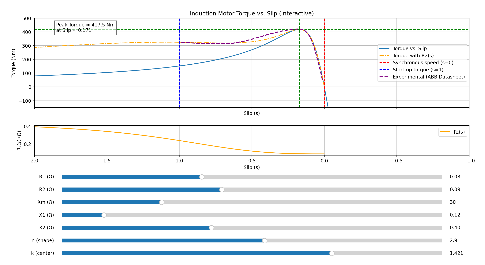

# Induction Motor Torque-Slip Visualizer

This project is a Python-based interactive visualizer for the **torque-slip characteristics** of an induction motor. It lets you dynamically explore how equivalent circuit parameters affect motor performance — and compare them directly with experimental data.

---

## ✨ Features

- Simulates torque-slip curve from the **Thevenin equivalent model**
- Two models:
  - Constant rotor resistance $ R_2 $
  - Frequency-dependent $ R_2(s) $ to account for rotor skin effect
- Live sliders for:
  - $ R_1, R_2, X_1, X_2, X_m $
  - Frequency response shape parameters: $ n $, $ k $
- Real-time overlay with **experimental data** from ABB datasheet
- A second subplot shows $ R_2(s) $ vs slip

---

## 📸 Screenshot

_A screenshot of the GUI goes here_

---

## 📐 Core Equations

### 1. **Torque equation (constant $ R_2 $)**
$$
T(s) = \frac{1}{\omega_s} \cdot \frac{n_{ph} \cdot |V_{1eq}|^2 \cdot \left(\frac{R_2}{s}\right)}{(R_{1eq} + \frac{R_2}{s})^2 + (X_{1eq} + X_2)^2}
$$

### 2. **Thevenin equivalent voltage**
$$
V_{1eq} = V_1 \cdot \frac{j X_m}{R_1 + j (X_1 + X_m)}
$$

### 3. **Thevenin equivalent impedance**
$$
Z_{1eq} = \frac{j X_m (R_1 + j X_1)}{R_1 + j (X_1 + X_m)} = R_{1eq} + j X_{1eq}
$$

### 4. **Frequency-dependent rotor resistance**
$$
R_2(s) = R_{2,\text{low}} + (R_{2,\text{high}} - R_{2,\text{low}}) \cdot \frac{s^n}{s^n + k}
$$

Where:
- $ R_{2,\text{low}} $: rotor resistance at low frequency (steady state)
- $ R_{2,\text{high}} $: effective rotor resistance at high frequency (startup)
- $ n $: sharpness of transition
- $ k $: position of transition center

### 5. **Slip calculation**
$$
s = \frac{n_s - n}{n_s}
$$
Where:
- $ n_s $: synchronous speed (e.g., 1500 rpm)
- $ n $: actual rotor speed

